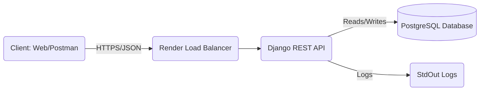
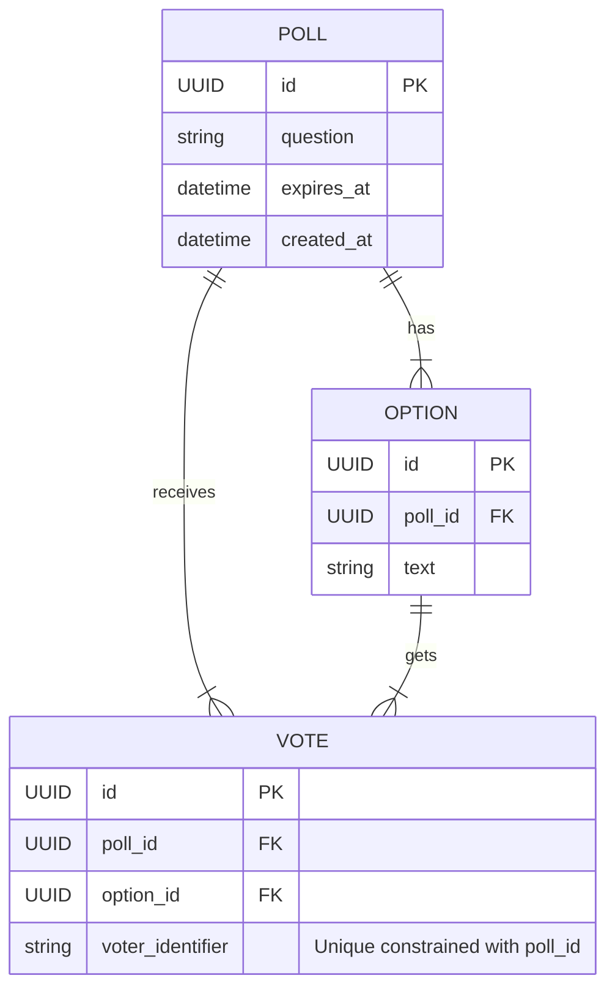

# 📊 Project Nexus: Presentation Slide Content

Use this content to create your slides (Google Slides / PowerPoint).

## 1. Architecture Diagram
*Copy this logic or take a screenshot of a drawn version.*

## 2. Entity Relationship Diagram (ERD) & Rationale
**Rationale:**
- **UUIDs** used everywhere for security (enumeration prevention).
- **Explicit Relationships** (ForeignKeys) to enforce structure.
- **Constraints** (`unique_vote_per_poll_per_voter`) to ensure data integrity at the database level.

## 3. Key Endpoints
| Method | Endpoint | Description |
| :--- | :--- | :--- |
| `GET` | `/api/polls/` | List all active polls (Paginated) |
| `POST` | `/api/polls/` | Create a new poll with options |
| `GET` | `/api/polls/{id}/` | Retrieve specific poll details |
| `POST` | `/api/polls/{id}/vote/` | Cast a vote (Idempotent/Secure) |
| `GET` | `/api/polls/{id}/results/` | Real-time aggregated results |

## 4. Best Practices Checklist
- ✅ **Validation**: DRF Serializers ensure clean input.
- ✅ **Constraints**: `UniqueConstraint` on `(poll, voter_identifier)` prevents double voting.
- ✅ **Indexing**: `db_index=True` on `poll`, `created_at` for fast filtering.
- ✅ **Security**: `DEBUG=False` in production, Secrets via Environment Variables.

## 5. Deployment Proof
- **Host**: Render (Oregon Region)
- **Database**: Managed PostgreSQL 16
- **Live URL**: `https://project-nexus-vumc.onrender.com`
- **Docs**: `https://project-nexus-vumc.onrender.com/api/docs/`
